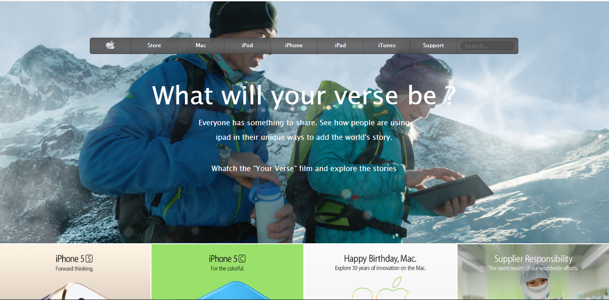

# Apple-clone
Clone of the old official Apple homepage for study purpose

> This is a practice case of Microverse HTML and CSS course. The goal is to clone the old apple homepage to implement gradients and floats.

Additional description about the project and its features.

## Built With

- HTML
- CSS
- Visual Studio Code

## Live Demo

[Live Demo](https://rawcdn.githack.com/EricMbouwe/Apple-clone/f9ee6ef3f9ff0220b360ab97567dccdf4a1fc04e/home.html)

## Getting Started

To get a local copy up and running follow these simple example steps.

### Prerequisites

- A compatible browser with HTML and CSS.

### Install

- Just clone the project

### Usage

- Open the index.html file in any browser or edit using Visual Code or the preference IDE for web development

## Authors

👤 **Eric Mbouwe**

- Github: [@ericmbouwe](https://github.com/ericmbouwe)
- Twitter: [@ericmbouwe](https://twitter.com/ericmbouwe)
- Linkedin: [@ericmbouwe](https://www.linkedin.com/in/ericmbouwe/)

## 🤝 Contributing

Contributions, issues and feature requests are welcome!

Feel free to check the [issues page](https://github.com/EricMbouwe/Apple-clone/issues).

## Show your support

Give a ⭐️ if you like this project!

## Acknowledgments

- The Odin Project
- [shayhowe](https://learn.shayhowe.com/html-css/setting-backgrounds-and-gradients/)

## 📝 License

This project is free to use as learning purposes. For any external content (e.g. logo, images, ...), please contact the proper author and check their license of use.
